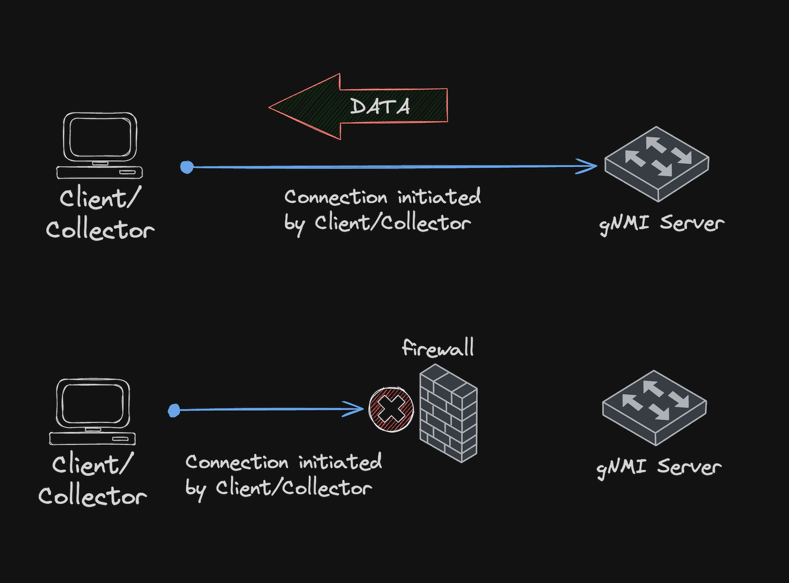
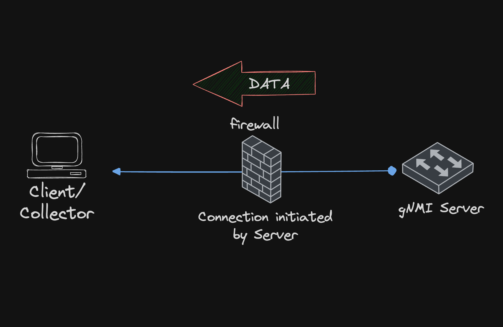
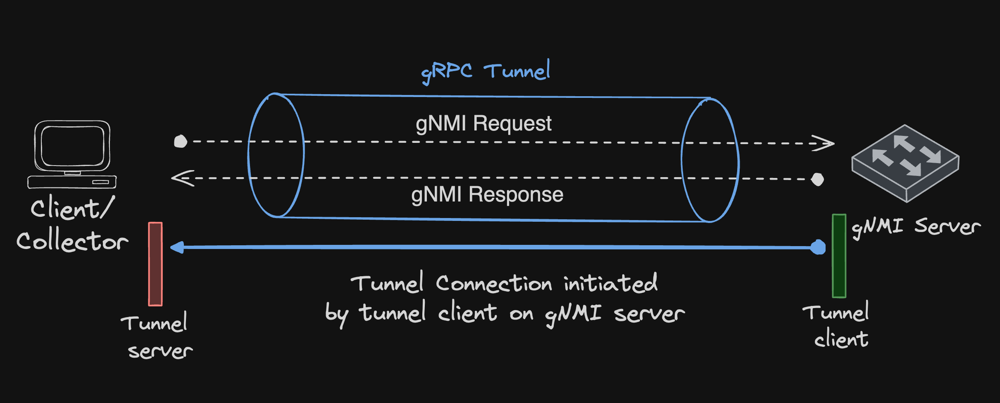

## Overview

The OpenConfig gNMI service typically operates on a **dial-in model**, where the client/collector initiates the
connection with the gNMI server (running on switch).

However, this model has limitations if the client cannot connect to the server, due to factors like firewalls blocking
inbound connections or the server being behind a router implementing NAT.

To address such issues, a **dial-out model** is more advantageous, allowing the server to instantiate a connection
in reverse to the client/collector.

| Dial-in | Dial-out |
|:-------:| :-------:|
|||

This page provides examples for configuring and using gNMI Dial-out on EOS, which can be achieved using two methods:

1. gNMIReverse client
2. gNMI Dial-out via gRPC Tunnel

### gNMIReverse client

gNMIReverse client is a Dial-Out gRPC service
([GitHub](https://github.com/aristanetworks/goarista/tree/master/cmd/gnmireverse_client))
that reverses the direction of the dial for gNMI Subscriptions, where the gNMIReverse client running along with
gNMI target (on the switch) sends data to the gNMIReverse Server.

#### Building the gNMIReverse binaries

:information_source: [Go](https://go.dev/doc/install) is required for compiling the
 gNMIReverse client and server binaries.

Once Go is set up, run the following commands to compile the `gnmireverse_client` binary,
which will be installed on the switch.

For 32-bit EOS:

```shell
GOOS=linux GOARCH=386 CGO_ENABLED=0 go install github.com/aristanetworks/goarista/cmd/gnmireverse_client@latest
```

For 64-bit EOS:

```shell
GOOS=linux GOARCH=amd64 CGO_ENABLED=0 go install github.com/aristanetworks/goarista/cmd/gnmireverse_client@latest
```

This will build the `gnmireverse_client` binary in the `$GOPATH/bin` or `$GOPATH/bin/linux_386` or
`$GOPATH/bin/linux_amd64` directory.

:information_source: **Note**: To find the architecture of EOS, use the following command:

```text
switch# show version | include Arch
Architecture: i686     <<-- 32 bit architecture

switch# show version | include Arch
Architecture: x86_64   <<-- 64 bit architecture
```

Copy the client binary to `/mnt/flash` directory on the switch, using scp or WinSCP

```shell
scp $GOPATH/bin/linux_amd64/gnmireverse_client <USERNAME>@<switch-MGMT-IP>:/mnt/flash/
```

To build the collector binary implementing a gNMIReverse server, use the following command:

```shell
go install github.com/aristanetworks/goarista/cmd/gnmireverse_server@latest
```

:information_source: **Note**: Starting from release EOS-4.28.1 `gnmireverse_client` and `gnmireverse_server`
binaries are also bundled with Octa on EOS.

```text
leaf2# show version | include Soft|Arch
Software image version: 4.28.1F-27567367.4281F
Architecture: x86_64

leaf2# bash which gnmireverse_client; which gnmireverse_server
/usr/bin/gnmireverse_client
/usr/bin/gnmireverse_server

leaf2# bash gnmireverse_client --help
Usage of gnmireverse_client:
  -clientSideWildcard
        forces client side wildcard resolution (default true)
  -collector_addr string
        Address of collector in the form of [<vrf-name>/]host:port.
        The host portion must be enclosed in square brackets if it is a literal IPv6 address.
        For example, -collector_addr mgmt/[::1]:1234
<--snipped-->
```

#### gNMIReverse client configuration

Before proceeding, the gNMI server needs to be enabled on the switch,
 refer to [this](../../../configuration/openconfig.md#gnmi)
section for sample configuration.

:information_source: **Note**: If subscribing to `eos_native` paths, Octa also needs to be enabled.
 Refer to [this](../../../configuration/openconfig.md#octa) section for more details on Octa.

To see the full list of options and documentation, run `gnmireverse_client --help`.
 Some of the important flags are explained
[in this section](https://github.com/aristanetworks/goarista/tree/master/cmd/gnmireverse_client#options).

With gNMI server enabled, gNMIReverse client daemon can be configured as follows:

> Default VRF

```text
!
daemon gnmireverse
   exec /mnt/flash/gnmireverse_client -target_value=leaf1
   -collector_addr=192.185.128.100:30000 -collector_tls=false
   -sample /interfaces/interface[name=Ethernet1]/state/counters@30s
   -subscribe system/memory/state/free
   no shutdown
!
```

:information_source: **Note**: When configuring on EOS CLI, combine the wrapped exec command flags into a single line.

In above example both gNMI server and collector are in *default VRF*:

- Target is the default Unix domain socket gNMI server, which does not require authentication.
- The collector/client `192.185.128.100` is reachable via the default VRF on port 30000.
- Counters for Interface Ethernet1 are sampled at a 30-second interval
- Subscription is done for OpenConfig path `system/memory/state/free`.

> Non default VRF

```text
!
daemon gnmireverse
   exec /mnt/flash/gnmireverse_client
   -target_addr=MGMT/172.100.100.2:6030 -target_value=spine1
   -username=admin -password=admin
   -collector_addr=MGMT/192.185.128.100:30000 -collector_tls=false
   -get_sample_interval=10s -get interfaces/interface/state/oper-status
   -get components/component/state/memory -get eos_native:/Eos/image
   no shutdown
!
```

:information_source: **Note**: When configuring on EOS CLI, combine the wrapped exec command flags into a single line.

In above example both gNMI server and collector are in *non default VRF* named `MGMT`:

- Target is the Ma1 interface IP in the `MGMT` VRF, utilizing the authentication credentials `admin/admin`.
- The collector/client `192.185.128.100` is reachable via the `MGMT` VRF on port 30000.
- A gNMI Get request is issued every 10 seconds to retrieve
  - all interfaces operational status
  - system memory
  - EOS image information from the EOS native path.

#### Running the gNMIReverse Server

Using the following command, the gNMIReverse server is started on the collector

```shell
gnmireverse_server -tls=false -addr=192.185.128.100:30000 -debug -1
```

<details><summary>Reveal output</summary>
<p>
```shell
client=172.100.100.2:34152 res=get n=0 rx_time=2025-10-21T05:42:21.103533957Z notif_time=2025-10-21T05:42:21.102427813Z
 last_rx_ago=0s last_notif_ago=0s latency=0s path=/interfaces/interface[name=Ethernet1]/state/oper-status val=UP
client=172.100.100.2:34152 res=get n=0 rx_time=2025-10-21T05:42:21.103533957Z notif_time=2025-10-21T05:42:21.102427813Z
 last_rx_ago=0s last_notif_ago=0s latency=0s path=/interfaces/interface[name=Ethernet2]/state/oper-status val=UP
client=172.100.100.2:34152 res=get n=0 rx_time=2025-10-21T05:42:21.103533957Z notif_time=2025-10-21T05:42:21.102427813Z
 last_rx_ago=0s last_notif_ago=0s latency=0s path=/interfaces/interface[name=Management1]/state/oper-status val=UP
client=172.100.100.2:34152 res=get n=0 rx_time=2025-10-21T05:42:21.103533957Z notif_time=2025-10-21T05:42:21.102427813Z
client=172.100.100.2:34152 res=get n=0 rx_time=2025-10-21T05:42:21.103533957Z notif_time=2025-10-21T05:42:21.102427813Z
 last_rx_ago=0s last_notif_ago=0s latency=0s path=/Eos/image/displayVersion val=4.35.0F-44178984.4350F
client=172.100.100.2:34152 res=get n=0 rx_time=2025-10-21T05:42:21.103533957Z notif_time=2025-10-21T05:42:21.102427813Z
 last_rx_ago=0s last_notif_ago=0s latency=0s path=/Eos/image/serialNum val=33b708fe-8b04-48db-bb84-7f77a6b3cc66
client=172.100.100.2:34152 res=get n=0 rx_time=2025-10-21T05:42:21.103533957Z notif_time=2025-10-21T05:42:21.102427813Z
 last_rx_ago=0s last_notif_ago=0s latency=0s path=/Eos/image/version val=4.35.0F
client=172.100.100.2:34152 res=get n=0 rx_time=2025-10-21T05:42:21.103533957Z notif_time=2025-10-21T05:42:21.102427813Z
 last_rx_ago=0s last_notif_ago=0s latency=0s path=/Eos/image/arch val=x86_64
client=172.100.100.2:34152 res=get n=0 rx_time=2025-10-21T05:42:21.103533957Z notif_time=2025-10-21T05:42:21.102427813Z
 last_rx_ago=0s last_notif_ago=0s latency=0s path=/Eos/image/blessed val=false
client=172.100.100.2:34152 res=get n=0 rx_time=2025-10-21T05:42:21.103533957Z notif_time=2025-10-21T05:42:21.102427813Z
 last_rx_ago=0s last_notif_ago=0s latency=0s path=/Eos/image/flavor val=cEOS
client=172.100.100.2:34152 res=get n=0 rx_time=2025-10-21T05:42:21.103533957Z notif_time=2025-10-21T05:42:21.102427813Z
 last_rx_ago=0s last_notif_ago=0s latency=0s path=/Eos/image/name val=image
client=172.100.100.2:34152 res=get n=0 rx_time=2025-10-21T05:42:21.103533957Z notif_time=2025-10-21T05:42:21.102427813Z
 last_rx_ago=0s last_notif_ago=0s latency=0s path=/Eos/image/release val=44178984.4350F
client=172.100.100.2:34152 res=get n=0 rx_time=2025-10-21T05:42:21.103533957Z notif_time=2025-10-21T05:42:21.102427813Z
 last_rx_ago=0s last_notif_ago=0s latency=0s path=/Eos/image/variant val=US
client=172.100.100.2:34152 res=get n=0 rx_time=2025-10-21T05:42:21.103533957Z notif_time=2025-10-21T05:42:21.102427813Z
 last_rx_ago=0s last_notif_ago=0s latency=0s path=/Eos/image/buildHost val=dhcp-224-68-53.sjc.aristanetworks.com
client=172.100.100.2:34152 res=get n=0 rx_time=2025-10-21T05:42:21.103533957Z notif_time=2025-10-21T05:42:21.102427813Z
 last_rx_ago=0s last_notif_ago=0s latency=0s path=/Eos/image/buildTime val=1759431887000000000
```

</p>
</details>

#### Troubleshooting

Use the following command to check the logs for configured gnmireverse daemon:

```shell
show agent gnmireverse logs
```

### gNMI Dial-out via gRPC Tunnel

Another way for using gNMI Dial-out involves leveraging the
gRPC Tunnel [specification](https://github.com/openconfig/grpctunnel/blob/main/doc/grpctunnel_design.md).
For more details on this feature
 refer to [EOS TOI](https://www.arista.com/en/support/toi/eos-4-27-0f/14851-gnmi-dial-out-via-grpc-tunnel).

In this method the gNMI Dial-out sequence involves the following steps:

- The gRPC tunnel client on the switch initiates a connection, dialing out to the collector.
- The collector, running a gRPC tunnel server, listens for and accepts the incoming tunnel request.
- A secure gRPC tunnel session is established between the switch and the collector.
- The collector sends a gNMI request to the gNMI server, via the established gRPC tunnel.
- The gNMI server returns the corresponding responses to the collector via the same tunnel.



#### gRPC tunnel client configuration

Under `management api gnmi` use the `transport grpc-tunnel <name>` to configure a gRPC tunnel client.

```text
!
management api gnmi
   transport grpc-tunnel tunnel1
      vrf MGMT
      destination 192.185.128.100 port 30000
      local interface Management1 port 50000
      target spine1
   provider eos-native
!
```

The above example configures a gRPC tunnel client named `tunnel1` (*multiple such clients can be configured*):

- The client is dialing out from non default VRF `MGMT`, this config is optional.
- The collector is running on 192.185.128.100 on port 30000, **this is a required configuration to start the client**.
- The client dials out using the Management1 interface IP and port 50000, this config is optional.
- The target ID is `spine1`, this is a user defined string, used to identify the switch used in the gRPC tunnel
  establishment and **is a required configuration to start the client**.
- The optional tunnel and gNMI server SSL/TLS profiles can also be configured.
- For more information on configuration options refer to the feature
   [TOI](https://www.arista.com/en/support/toi/eos-4-27-0f/14851-gnmi-dial-out-via-grpc-tunnel).

Following command will show the the status of gRPC tunnel clients:

```text
switch# show management api gnmi
Octa: enabled

Transport gRPC-tunnel: tunnel1
Status: tunnel connection established
Enabled: yes
VRF: MGMT
Destination address: 192.185.128.100, port 30000
Local interface: Management1
Local address: 172.100.100.2, port 50000
Target ID: spine1
```

#### gNMIC Tunnel Server

This demo will be using the tunnel server which is available as part of the
 [gNMIc](https://gnmic.openconfig.net/user_guide/tunnel_server/) tool.
Following `gnmic.yml` configuration file is used to specify all the command line flags by means of a single file.

```yaml
---
insecure: true
log: true
username: admin
password: admin

subscriptions:
  system-info:
    mode: once
    paths:
      - '/system/state/software-version'
      - '/system/state/hostname'
  port-stats:
    paths:
      - 'interfaces/interface[name=Management1]/state/counters/in-octets'
      - 'interfaces/interface[name=Management1]/state/counters/out-octets'
    stream_mode: on-change
  mem-stats:
    sample-interval: 5s
    paths:
      - 'eos_native:/Kernel/proc/meminfo'
  cpu-stats:
    sample-interval: 5s
    paths:
      - 'eos_native:/Kernel/proc/cpu/utilization/total'

tunnel-server:
  address: ":30000"
  targets:
    - id: spine1
      config:
        subscriptions:
          - system-info
          - mem-stats
          - port-stats
```

Using the following command, the tunnel server is started on the collector:

```shell
gnmic --config ./gnmic.yml --use-tunnel-server subscribe
```

<details><summary>Reveal output</summary>
<p>
```shell
2025/10/21 17:48:14.648027 [gnmic] tunnel server discovered target {ID:spine1 Type:GNMI_GNOI}
2025/10/21 17:48:14.648373 [gnmic] starting target "spine1" listener
2025/10/21 17:48:14.648405 [gnmic] queuing target "spine1"
2025/10/21 17:48:14.648417 [gnmic] subscribing to target: "spine1"
2025/10/21 17:48:14.648896 [gnmic] target "spine1" gNMI client created
2025/10/21 17:48:14.648964 [gnmic] dialing tunnel connection for tunnel target "spine1"
2025/10/21 17:48:14.648904 [gnmic] sending gNMI SubscribeRequest:
subscribe='subscribe:{subscription:{path:{elem:{name:"system"}  elem:{name:"state"}  elem:{name:"software-version"}}}
  subscription:{path:{elem:{name:"system"}  elem:{name:"state"}  elem:{name:"hostname"}}}  mode:ONCE}', mode='ONCE',
   encoding='JSON', to spine1
2025/10/21 17:48:14.649543 [gnmic] sending gNMI SubscribeRequest:
 subscribe='subscribe:{subscription:{path:{origin:"eos_native"  elem:{name:"Kernel"}  elem:{name:"proc"}
   elem:{name:"meminfo"}}  sample_interval:5000000000}}', mode='STREAM', encoding='JSON', to spine1
{
  "source": "spine1",
  "subscription-name": "system-info",
  "timestamp": 1761025184960219526,
  "time": "2025-10-21T11:09:44.960219526+05:30",
  "updates": [
    {
      "Path": "system/state/software-version",
      "values": {
        "system/state/software-version": "4.35.0F-44178984.4350F"
      }
    }
  ]
}
{
  "source": "spine1",
  "subscription-name": "system-info",
  "timestamp": 1761025185169768456,
  "time": "2025-10-21T11:09:45.169768456+05:30",
  "updates": [
    {
      "Path": "system/state/hostname",
      "values": {
        "system/state/hostname": "spine1"
      }
    }
  ]
}
{
  "sync-response": true
}
{
  "source": "spine1",
  "subscription-name": "mem-stats",
  "timestamp": 1761025184961897312,
  "time": "2025-10-21T11:09:44.961897312+05:30",
  "prefix": "eos_native:Kernel/proc/meminfo",
  "updates": [
    {
      "Path": "bounce",
      "values": {
        "bounce": 0
      }
    }
```

</p>
</details>

Another collector which can be used is `gnmi_collector`, detailed example for the same is available
 in the [GitHub](https://github.com/aristanetworks/gnmi/tree/master/cmd/gnmi_collector) repo.

#### Troubleshooting

Use the following command to check the Octa/Openconfig agent logs:

```shell
show agent Octa logs         <<-- use this command if Octa is enabled
show agent OpenConfig logs
```
